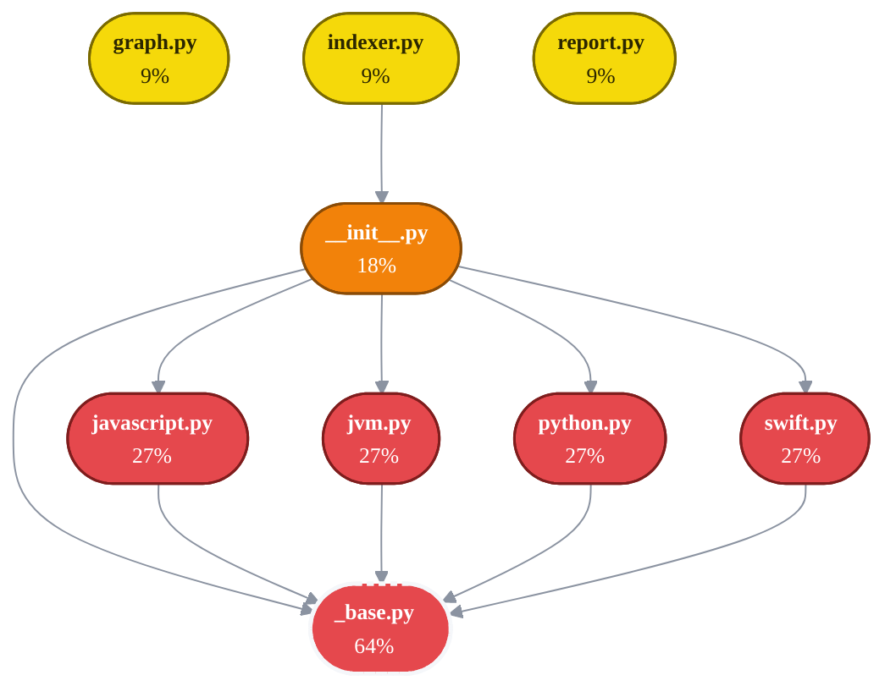

# 💥 BlastRadius Report

> Generated by BlastRadius v0.1.0 at commit `unknown` — do not edit by hand; regenerate with `python3 .claude/skills/blastradius/run.py`

This report answers **"what breaks if I change this?"** for every file and class in the repo, from a statically-built, bidirectional dependency graph. No LLM, no server — deterministic analysis, committed here so the whole team (and coding agents) can read it.

## Overview

| Files analyzed | Dependency edges | Imports resolved | Type-ref edges | Ambiguous (skipped, not guessed) |
|---:|---:|---:|---:|---:|
| 12 | 14 | 18/58 (31%) | 0 | 0 |

Edges are created **only** when an import or type reference resolves unambiguously to a repo file. External/unresolvable imports create no edge — this graph under-claims rather than lies.

## Risk tiers

| Tier | Meaning | Files |
|---|---|---:|
| 🔴 critical | ≥25% of repo depends on it | 5 |
| 🟠 high | ≥10% | 1 |
| 🟡 medium | ≥3% | 3 |
| 🟢 low | <3%, but depended on | 0 |
| ⚪ none | nothing depends on it | 3 |

## Top hotspots — handle with care

| # | File | Tier | Direct | Transitive | % of repo | Depth | Load-bearing symbols |
|--:|---|---|---:|---:|---:|---:|---|
| 1 | `.claude/skills/blastradius/adapters/_base.py` ⚠️hub | 🔴 critical | 5 | 7 | 63.6% | 2 | `Symbol` (5), `ImportRef` (5) |
| 2 | `.claude/skills/blastradius/adapters/javascript.py` | 🔴 critical | 1 | 3 | 27.3% | 2 | — |
| 3 | `.claude/skills/blastradius/adapters/jvm.py` | 🔴 critical | 1 | 3 | 27.3% | 2 | — |
| 4 | `.claude/skills/blastradius/adapters/python.py` | 🔴 critical | 1 | 3 | 27.3% | 2 | — |
| 5 | `.claude/skills/blastradius/adapters/swift.py` | 🔴 critical | 1 | 3 | 27.3% | 2 | — |
| 6 | `.claude/skills/blastradius/adapters/__init__.py` | 🟠 high | 2 | 2 | 18.2% | 1 | `availability_report` (2), `get_adapter` (1) |
| 7 | `.claude/skills/blastradius/graph.py` | 🟡 medium | 1 | 1 | 9.1% | 1 | `build_graph` (1) |
| 8 | `.claude/skills/blastradius/indexer.py` | 🟡 medium | 1 | 1 | 9.1% | 1 | `find_repo_root` (1), `build_facts` (1) |
| 9 | `.claude/skills/blastradius/report.py` | 🟡 medium | 1 | 1 | 9.1% | 1 | `render` (1) |

## Most depended-on symbols

| Symbol | Kind | Defined in | Direct dependents | Transitive | % of repo |
|---|---|---|---:|---:|---:|
| `Symbol` | class | `.claude/skills/blastradius/adapters/_base.py:7` | 5 | 7 | 63.6% |
| `ImportRef` | class | `.claude/skills/blastradius/adapters/_base.py:21` | 5 | 7 | 63.6% |
| `ExtractResult` | class | `.claude/skills/blastradius/adapters/_base.py:40` | 5 | 7 | 63.6% |
| `get_text` | function | `.claude/skills/blastradius/adapters/_base.py:48` | 5 | 7 | 63.6% |
| `first_line` | function | `.claude/skills/blastradius/adapters/_base.py:53` | 5 | 7 | 63.6% |
| `head_keyword` | function | `.claude/skills/blastradius/adapters/_base.py:57` | 3 | 7 | 63.6% |
| `availability_report` | function | `.claude/skills/blastradius/adapters/__init__.py:50` | 2 | 2 | 18.2% |
| `get_adapter` | function | `.claude/skills/blastradius/adapters/__init__.py:38` | 1 | 2 | 18.2% |
| `supported_extensions` | function | `.claude/skills/blastradius/adapters/__init__.py:45` | 1 | 2 | 18.2% |
| `build_graph` | function | `.claude/skills/blastradius/graph.py:527` | 1 | 1 | 9.1% |
| `find_repo_root` | function | `.claude/skills/blastradius/indexer.py:57` | 1 | 1 | 9.1% |
| `build_facts` | function | `.claude/skills/blastradius/indexer.py:119` | 1 | 1 | 9.1% |
| `render` | function | `.claude/skills/blastradius/report.py:70` | 1 | 1 | 9.1% |

## Hubs (depended on by ≥5 files)

Utility modules the whole repo leans on. Any change here needs extra review — but their ubiquity is usually by design.

- `.claude/skills/blastradius/adapters/_base.py` — 5 direct dependents, 63.6% of repo transitively

## By directory

| Directory | Files | Riskiest file | Its radius |
|---|---:|---|---:|
| `.claude/skills/` | 12 | `.claude/skills/blastradius/adapters/_base.py` | 63.6% |

## Dependency map

Top hotspots, colored by risk tier; arrows point from a file to what it depends on (**A → B** means *A breaks if B breaks*). A dashed white outline marks a hub.

---

<b>Methodology & limitations</b>

- **Edges**: path-aware import resolution (Python/JS), declared-package + type-name resolution (Java/Kotlin), uniqueness-gated type references (Swift). Ambiguous references are *skipped, never guessed*. In Swift, references to a local type whose name shadows a ubiquitous framework type (SwiftUI `Button`/`Section`, Foundation `Data`, …) are also skipped — the reference can't be told apart from the framework type.
- **Symbol attribution**: each edge records the symbols it enters a file through (imported names, referenced types). Whole-module imports can't be attributed and count conservatively against every symbol in the file.
- **Score**: transitive dependents with per-hop decay (Σ 0.6^(depth−1)) — a direct importer matters more than one 4 hops away.
- **Static only**: runtime wiring (dependency injection, reflection, event buses, HTTP/RPC between services) is invisible to this analysis. Treat the radius as a *floor*, not a ceiling.
- Generated by [BlastRadius](https://github.com/rahulr85r/blastradius) — tree-sitter + pure-stdlib analysis; no LLM, no network, no server.

